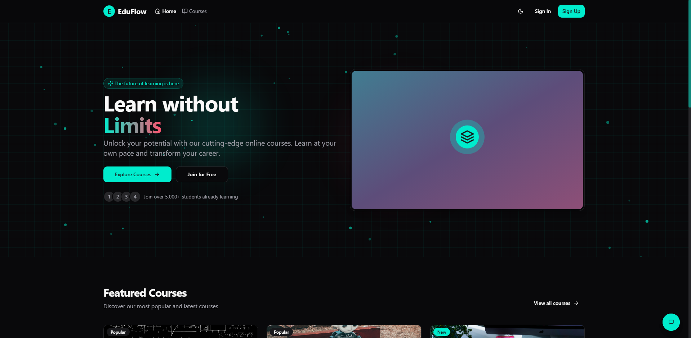

# EduFlow - Modern Online Learning Platform 🚀

<div align="center">
  
  <h3>✨ Learn Anywhere, Anytime ✨</h3>
  
## 📋 Overview 

EduFlow is a comprehensive full-stack e-learning platform built with the MERN stack (MongoDB, Express, React, Node.js). It delivers a modern learning experience with an intuitive interface, interactive courses, and powerful admin tools. 🌟

<div align="center">
  
  <p>🎓 <i>Transform your learning journey with EduFlow's interactive experience!</i> 🎓</p>
</div>

## ✨ Key Features 

### 🔐 Authentication & Authorization
- **Multiple Login Methods**: Email/password and Google OAuth integration 🔑
- **Role-Based Access**: Admin and student portals with appropriate permissions 👩‍💼👨‍🎓
- **Secure Sessions**: JWT authentication with "Remember Me" option 🛡️
- **Smooth Onboarding**: Quick signup process to get started in seconds! ⚡

### 📚 Course Management
- **Intuitive Course Catalog**: Browse, search, and filter courses easily 🔍
- **Admin Tools**: Comprehensive course creation and management dashboard 🛠️
- **Rich Content**: Support for video lectures, documents, and interactive quizzes 📹📄✏️
- **Analytics**: Detailed course performance metrics with beautiful charts 📊

### 👨‍🎓 Student Experience
- **Personalized Dashboard**: Track enrolled courses and progress at a glance 📈
- **Interactive Learning**: Video playback, quiz attempts, and progress tracking 🎯
- **Achievement System**: Earn certificates upon course completion 🏆
- **Bookmarking**: Save courses for later viewing with one click 🔖
- **Mobile Friendly**: Learn on any device, anytime, anywhere! 📱💻

### 📜 Certificate System
- **Automatic Generation**: PDF certificates upon course completion 🎉
- **Verification Portal**: Public verification of certificate authenticity 🔍
- **Professional Design**: Customizable certificate templates for a polished look ✨
- **Social Sharing**: Easy sharing to LinkedIn and other platforms for career growth 🌐

### 👤 User Profile
- **Customizable Profile**: Update personal information and preferences easily 😎
- **Avatar Management**: Upload and manage profile pictures to express yourself 🖼️
- **Learning Statistics**: Visual representation of learning journey with colorful charts 📊
- **Settings Panel**: Manage notification and account preferences your way ⚙️

### 🤖 AI Assistant
- **24/7 Support**: Intelligent chat assistant for course recommendations 💬
- **Contextual Help**: Tailored assistance based on user location in the app 🧠
- **Voice Capability**: Optional voice interaction mode for hands-free learning 🎤
- **Personalized Responses**: Smart suggestions based on your learning history 🔮

## 🛠️ Tech Stack

### Frontend 🎨
<div>
  
  
  
  
</div>

- 🧭 React Router for smooth navigation
- 🧩 shadcn/ui for beautiful component library
- 📄 jsPDF and html2canvas for certificate generation
- 📱 Responsive design for all devices

### Backend 🏗️
<div>
  
  
  
  
</div>

- 🗄️ Mongoose for MongoDB ORM
- ✅ Express Validator for request validation
- 📁 Multer for file uploads
- 🔒 Secure API endpoints

## 🚀 Getting Started

### Prerequisites
- 📦 Node.js (v14 or higher)
- 🗃️ MongoDB (local or Atlas)
- 🔥 Firebase account (for Google authentication)

### Installation 🔧

1. **Clone the repository** 📋
   ```bash
   git clone https://github.com/nveed-gung/eduflow.git
   cd eduflow
   ```

2. **Install dependencies** 📥
   ```bash
   npm run install-all
   ```

3. **Configure environment variables** ⚙️
   - Create a `.env` file in the server directory based on `.env.example`
   - Set up MongoDB connection
   - Configure Firebase credentials

4. **Run the application** 🏃‍♂️
   ```bash
   # Development mode (runs both client and server)
   npm run dev
   
   # Run client only
   npm run client
   
   # Run server only
   npm run server
   ```

5. **Access the application** 🌐
   - Frontend: http://localhost:5173
   - Backend API: http://localhost:5000
   - Start learning! 🎓

## 🌐 Deployment to Render

EduFlow is optimized for seamless deployment to [Render](https://render.com) as a single Web Service. 🚢

### Deployment Steps 📝

1. **Create a MongoDB Atlas Database** 🗃️
   - Sign up for [MongoDB Atlas](https://www.mongodb.com/cloud/atlas)
   - Create a new cluster
   - Set up database access (username & password)
   - Add network access for Render IPs (0.0.0.0/0 for simplicity)
   - Get your connection string

2. **Set up GitHub Repository** 📁
   ```bash
   git add .
   git commit -m "Prepare for deployment"
   git push
   ```

3. **Deploy to Render** 🚀
   - Sign up for [Render](https://render.com)
   - From your dashboard, select "New" and "Web Service"
   - Connect your GitHub repo
   - Configure your Web Service:
     - **Name**: `eduflow` (or your preferred name)
     - **Environment**: `Node`
     - **Build Command**: `bash ./render-build.sh`
     - **Start Command**: `NODE_ENV=production npm start`
     - **Auto-Deploy**: Enable

4. **Set Environment Variables** 🔐
   - `NODE_ENV`: `production`
   - `MONGODB_URI`: Your MongoDB Atlas connection string
   - `JWT_SECRET`: Your secret key for JWT tokens
   - `RENDER`: `true`
   - All Firebase configuration variables

5. **Wait for Deployment** ⏳
   - Render will build and deploy your application
   - Once deployed, you can access your application at the provided Render URL
   - Share with the world! 🌍

## ⚙️ Environment Variables

### Server Environment Variables 🖥️
```
PORT=5000
MONGODB_URI=your_mongodb_connection_string
JWT_SECRET=your_jwt_secret
CLIENT_URL=http://localhost:5173
FIREBASE_PROJECT_ID=your_firebase_project_id
FIREBASE_PRIVATE_KEY=your_firebase_private_key
FIREBASE_CLIENT_EMAIL=your_firebase_client_email
```

### Client Environment Variables 📱
For development (`.env.development`):
```
VITE_API_URL=http://localhost:5000/api
VITE_FIREBASE_API_KEY=your_firebase_api_key
VITE_FIREBASE_AUTH_DOMAIN=your_firebase_auth_domain
VITE_FIREBASE_PROJECT_ID=your_firebase_project_id
VITE_FIREBASE_STORAGE_BUCKET=your_firebase_storage_bucket
VITE_FIREBASE_APP_ID=your_firebase_app_id
```

## 📁 Folder Structure

```
eduflow/
├── client/               # 🖥️ Frontend React application
│   ├── public/           # 🌐 Static assets
│   └── src/              # 💻 React source code
│       ├── components/   # 🧩 Reusable components
│       ├── context/      # 🌍 React context providers
│       ├── hooks/        # 🎣 Custom hooks
│       ├── lib/          # 🛠️ Utility functions
│       ├── pages/        # 📄 Page components
│       └── App.tsx       # 🚀 Main App component
│
├── server/               # 🖧 Backend Node.js application
│   ├── src/              # 📂 Server source code
│   │   ├── middleware/   # 🔄 Express middleware
│   │   ├── models/       # 📊 Mongoose models
│   │   ├── routes/       # 🛣️ API routes
│   │   ├── seeders/      # 🌱 Database seed scripts
│   │   └── index.js      # 🏁 Server entry point
│   └── .env              # 🔒 Environment variables
│
└── package.json          # 📦 Root package.json for project-wide scripts
```

## 🔍 Troubleshooting

### Connection Issues 🔌

If you're seeing `Error fetching courses: Pt` or `ERR_CONNECTION_REFUSED` errors:

1. **Clear Browser State:** 🧹
   - Open browser console (F12)
   - Copy and paste the code from `reset-app-state.js` to clear local storage and reload
   - This often resolves client-side connection caching issues

2. **Check Network Configuration:** 🔧
   - Ensure the API URL is configured properly in `client/src/lib/api.ts`
   - The production build should be using a relative path (`/api`) not an absolute URL
   - Check browser console to see which API URL is being used

3. **Verify Environment Variables:** 📋
   - Client: Ensure the `.env.production` file contains `VITE_API_URL=/api`
   - All API calls should use the centralized API client from `client/src/lib/api.ts`

4. **Run Diagnostic Script:** 🩺
   ```bash
   node diagnose-connection.js
   ```

### API Connection Issues in Production 🌐

If your deployed app on Render continues to show API connection errors:

1. **Check Render Logs:** 📊
   - Look for any server-side errors in the Render dashboard logs
   - Verify the server is starting correctly and connecting to MongoDB

2. **Inspect Network Requests:** 🔍
   - Use browser developer tools to check network requests
   - Ensure requests are going to `/api/*` paths, not `http://localhost:5000/api/*`

3. **Force a Clean Deployment:** 🧼
   - Commit your changes with these API fixes:
   ```bash
   git add .
   git commit -m "Fix API connection issues in production"
   git push
   ```
   - If automatic deployments are enabled, this will trigger a fresh build
   - Otherwise, manually deploy from the Render dashboard

4. **Manual Client Fix:** 💪
   - If you still have issues, try the reset script in the browser console:
   ```javascript
   localStorage.clear();
   sessionStorage.clear();
   location.reload(true);
   ```

## 🙏 Acknowledgments

- 🧩 [shadcn/ui](https://ui.shadcn.com/) for the beautiful component library
- 🎨 [Lucide Icons](https://lucide.dev/) for the elegant icon set
- 💅 [Tailwind CSS](https://tailwindcss.com/) for efficient styling
- 🔥 [Firebase](https://firebase.google.com/) for authentication services
- 🗃️ [MongoDB Atlas](https://www.mongodb.com/cloud/atlas) for database hosting

## 🎉 Let's Get Learning! 

Join the EduFlow community today and transform your learning experience! Whether you're a student looking to expand your knowledge or an instructor ready to share your expertise, EduFlow provides the perfect platform for your educational journey. 🚀

<div align="center">
  <h3>🌟 Happy Learning! 🌟</h3>
</div>


